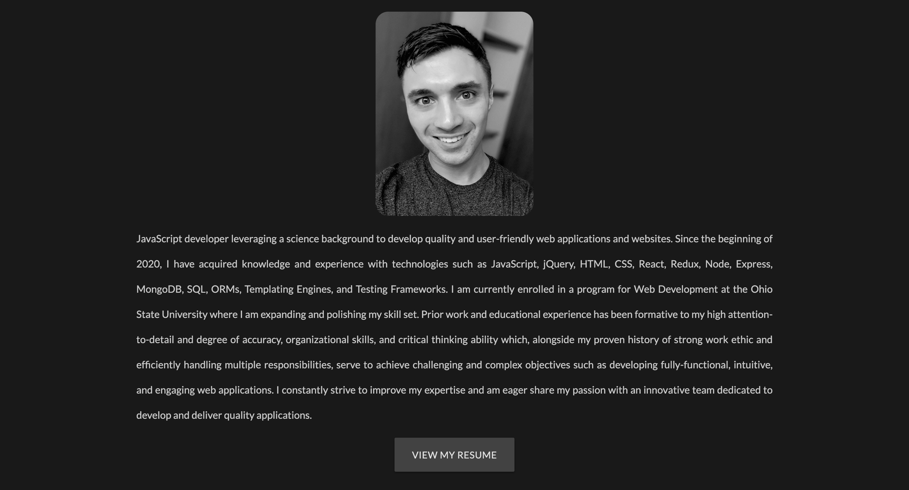

# Portfolio

## Description

My web development project portfolio. Portfolio projects are managed with separate [Project Manager](https://github.com/jkole822/Portfolio-Project-Manager).

## Table of Contents

- [Views](#views)
- [Technology](#technology)
- [Questions](#questions)
- [License](#license)

## Views

### Header

### About Me

### Projects

## Technology

- Node
- Express
- MongoDB
- Mongoose
- EJS
- jQuery
- Locomotive Scroll
- Isotope
- Materialize CSS

## Questions

Please feel free to contact via email if you have any questions pertaining to this project.  
Email: jkole822@gmail.com  
[GitHub Profile](https://github.com/jkole822)

## License

[MIT](https://choosealicense.com/licenses/mit)
